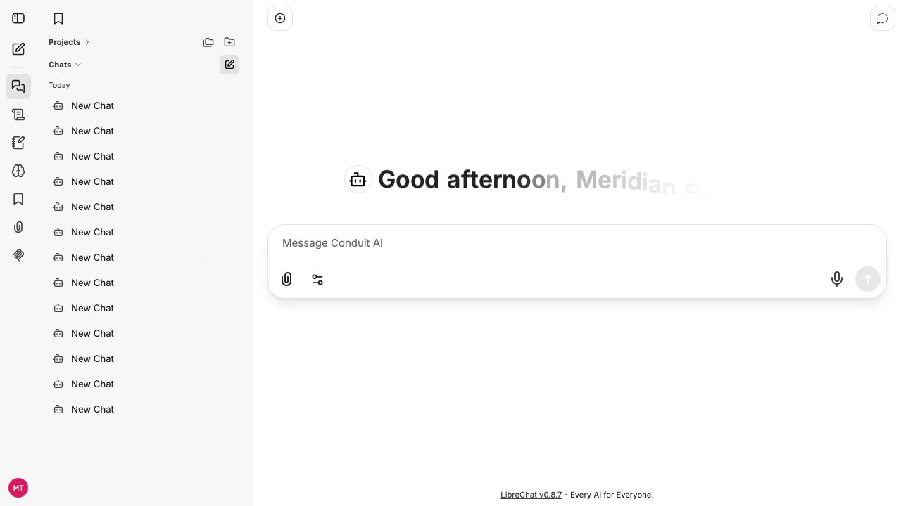
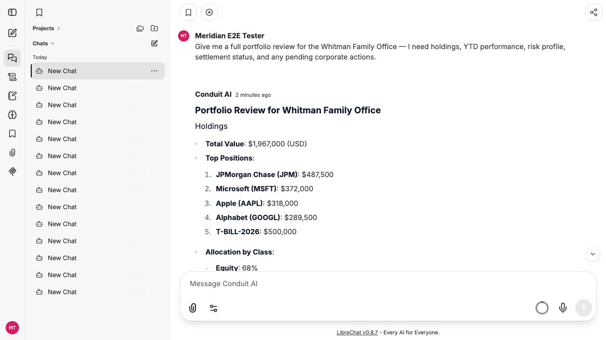

# Conduit — Enterprise AI Gateway

> One plain-English question → the right specialist systems, across HTTP and MCP → one grounded,
> attributed answer — with every routing and access decision visible live.
>
> **This is the master document.** It covers what Conduit is, why it matters, how it works, what
> every module does, how to run and demo it, and how to extend it. Deeper references are linked at
> the end.

---

## The 30-second version

A bank relationship manager asks, in plain English: *"Give me a complete overview of the Whitman
relationship — holdings, performance, settlement status, and cash."* That one question touches a
dozen systems, each with its own protocol, owner, and access rules.

**Conduit** is a single Java service that sits behind a chat box, figures out which specialist
systems hold the answer, checks the banker is entitled to that data, calls those systems in
parallel (over HTTP **and** MCP), and streams back **one synthesized answer where every number is
real** — while showing the entire decision live in a glass-box panel.

And the thing that makes it a platform, not a demo:

> **World B — the gateway carries zero domain knowledge.** A new business line (insurance,
> lending, anything) is onboarded by adding **manifest files + a coverage-service URL** — with
> **no change to gateway code.** We prove it here: insurance was bolted onto a wealth-and-
> servicing gateway by manifest alone.

---

## Why this is hard (and why generic chatbots fail here)

A relationship manager's question fans out across portfolio holdings, performance, settlements,
custody, cash, risk, and goals. Today answering it means swivel-chairing across portals or waiting
on ops. Drop a generic chatbot on top and you get three dealbreakers for a bank:

- **It hallucinates numbers.** A portfolio value that's *almost* right is worse than no answer.
- **It ignores entitlements.** A banker must only ever see relationships in their own book.
- **It's a black box.** Compliance can't ship what it can't audit.

Conduit is built to kill all three:

| The bank's fear | Conduit's answer |
|---|---|
| "It'll make up a number." | Agent outputs are the **only** ground truth. The LLM summarizes; it never computes, recalls, or invents — and it never produces an ID. |
| "It'll leak data across books." | Entitlements are checked **before** any data is fetched — structural (role × resource) *and* data-aware (is this entity in your book?). |
| "We can't audit it." | A live **glass box** shows the whole decision: what was asked, how it routed, what it was allowed to see, which systems answered, how long each took. |
| "It'll silently break." | Partial-result tolerant: a dead agent never cancels its siblings; the answer comes back from survivors and **states what's missing**. |

<details>
<summary><b>📸 Screenshots — what it looks like when it comes up</b> (click to expand)</summary>

<br>

**The Conduit-branded chat (home):**



**A grounded answer to the hero prompt** — one synthesized reply, every number traceable to a
source system (relationship `REL-00042`, `$1,967,000`, the actual positions):



> Captured live by the screenshots e2e spec (`tests/e2e/tests/11-screenshots.spec.ts`) — run it to
> regenerate them so this README never goes stale.

</details>

---

## Architecture at a glance

```
   Relationship                    ┌──────────────────────────────────────────────┐
   Manager                         │               CONDUIT GATEWAY                 │
     │  "Give me a full picture    │     Java 21 · Spring Boot · virtual threads   │
     │   of the Whitman …"         │     World B: a manifest interpreter with      │
     ▼                             │               zero domain knowledge           │
 ┌──────────┐   OpenAI  /v1        │                                               │
 │ LibreChat│ ───────────────────▶ │  ① Intent + entity extraction   (LLM)         │
 │  (chat)  │ ◀───── SSE stream ── │  ② Semantic route               (Redis HNSW)  │
 └──────────┘                      │  ③ Entitlement gate             (Cerbos +     │
     ▲                             │                                  coverage)    │
     │ trace events (SSE)          │  ④ Parallel fan-out             (HTTP + MCP)  │
     ▼                             │  ⑤ Grounded synthesis           (LLM, stream) │
 ┌──────────┐                      │  ⑥ Observe                      (OTel + glass)│
 │ Glass-Box│                      └───┬──────────────┬──────────────┬─────────────┘
 │  (live   │            HTTP (OpenAPI)│       MCP/SSE │       verify │ JWT (RS256)
 │  trace)  │                          ▼              ▼              ▼
 └──────────┘              ┌───────────────────┐ ┌──────────┐ ┌──────────────┐
                           │ Wealth · Insurance│ │ Asset-   │ │  Axiom IAM   │
                           │ agents (FastAPI)  │ │ Servicing│ │ (OIDC issuer,│
                           └─────────┬─────────┘ │(MCP/Fast │ │  RS256/JWKS) │
                                     │            │  MCP)    │ └──────────────┘
        "is this entity in the       ▼            └──────────┘
         user's book of business?"  ┌────────────────┐   ┌──────────────────────────┐
                                    │ Coverage svcs  │   │ Observability             │
                                    │ (book-of-biz)  │   │ Langfuse · Grafana ·      │
                                    └────────────────┘   │ Tempo · Loki · Prometheus │
                                                         └──────────────────────────┘
```

The gateway is **the only thing that's "the product."** The agents are Python stand-ins for what a
bank's domain teams would expose — they're external systems on the request path, not part of the
brain.

---

## See it in 5 minutes

```bash
cp .env.example .env          # then set CONDUIT_LLM_SYNTHESIZER_API_KEY (an OpenAI-compatible key)
docker compose up -d          # the core stack
bash scripts/seed-users.sh    # demo identities (rm_jane, uw_sam, …)
docker compose --profile eval up -d eval-worker   # optional: continuous quality scoring
```

Then open the chat and ask the hero question:

| Surface | URL | Login |
|---|---|---|
| **Chat** (LibreChat) | http://localhost:3080 | `rm_jane` / `Meridian@2024` — or **"Login with Meridian SSO"** |
| **Glass-Box** (live decision) | http://localhost:4000 | — |
| **Langfuse** (traces + scores) | http://localhost:3030 | `admin@meridian.bank` / `changeme` |
| **Grafana** (metrics/logs/traces) | http://localhost:3000 | `admin` / `changeme` |
| **Gateway** (OpenAI API) | http://localhost:8080/v1 | JWT or `X-User-Id` |
| **Axiom** (identity) | http://localhost:8084 | OIDC issuer |

> **Two host prereqs** (not in the repo): a real LLM key in `.env`, and — for browser SSO — an
> `/etc/hosts` line `127.0.0.1 host.docker.internal`.

---

## The four things to demo

All live, all on the same stack, all visible end-to-end (chat + glass-box + traces + scores):

1. **Ask the hero question** → one grounded answer fanned out across HTTP + MCP agents.
   > *"Give me a complete overview of the Whitman relationship: holdings, performance, settlement
   > status, and cash position."* Then follow up — *"which holding is largest, and how much cash is
   > unsettled?"* — and it answers from memory without you restating the client.
2. **Kill an agent mid-question** (`docker compose stop <agent>`) → the answer still comes back,
   honestly stating what's missing.
3. **Ask about a client you don't cover** (*"show me the Okafor relationship"* as `rm_jane`) → it's
   denied **before** any data is fetched.
4. **Ask something ambiguous** (*"what's the latest on my client?"*) → a scoped clarifying question,
   not a hallucination.

---

## How a question flows — the six stages

The glass-box renders these live, one panel each.

| # | Stage | What happens | The guardrail |
|---|---|---|---|
| 1 | **Intent + Entities** | An LLM classifies the ask (fetch / follow-up / clarify) and extracts the *human references* ("the Whitman relationship") | The LLM never invents IDs — it extracts references only |
| 2 | **Resolve / Route** | The prompt is embedded and vector-matched against agent capabilities to pick the right subset | Confidence floor; shows selected **and** rejected agents |
| 3 | **Entitlement** | Structural check (role × resource class, via Cerbos) + data-aware check (is this entity in the user's book?, via coverage) | Prune **before** fan-out — denied data is never fetched |
| 4 | **Fan-out** | The chosen agents are called in parallel over their native protocols (HTTP + MCP), on virtual threads, behind circuit breakers | A failed agent never cancels its siblings |
| 5 | **Synthesis** | An LLM merges agent outputs into one streamed answer | Agent outputs are the **only** ground truth; every number traces to one; missing data is stated |
| 6 | **Observe** | Spans, metrics, and glass-box events throughout; quality scored asynchronously | PII-aware logging; data and instructions kept separate |

A **deterministic clarify** sits across all of this: if the user's references don't cover what the
agents require (`extracted ∩ required_context = ∅`), Conduit asks a scoped question instead of
guessing — decided in code, not by an LLM.

---

## The module map — what each part is

```
orchestrator-demo/
├── gateway/        ← THE BRAIN (Java 21, Spring Boot, virtual threads) — the only "product"
├── mock-agents/    ← the specialist systems it orchestrates (Python stand-ins)
├── iam-service/    ← Axiom: identity provider (OIDC, RS256-signed tokens)
├── registry/       ← the manifests that describe domains + agents (World B's DNA)
├── glassbox/       ← the live decision-trace UI (the trust surface)
├── librechat/      ← the chat UI (config + cosmetic rebrand only — no fork)
├── admin-ui/       ← agent/manifest registry admin
├── eval/           ← quality scoring (release gate + continuous)
├── infra/          ← Cerbos policies, Grafana, OTel collector configs (config, not code)
├── tests/          ← e2e (Playwright) · load (k6) · integration
├── scripts/        ← run / seed / verify / world-b-check
└── docs/           ← the runbook, the World-B spec, model strategy
```

**`gateway/` — the orchestration brain.** One Java/Spring Boot service. No Python, no LangChain, no
external agent gateway inside it. Its shape mirrors the lifecycle: `domain/intent` (classify +
extract), `domain/manifest` (the source of all domain knowledge), `domain/coverage`
(book-of-business: discover/check/resolve), `domain/auth` (Cerbos + identity seam),
`domain/session` (a conversation = a session, carried across turns), `orchestration/executor` (the
flat-plan executor + Resilience4j harness), `adapter/http` + `adapter/mcp` (one `ProtocolAdapter`
interface), `synthesis` (Extract→Resolve→Bind, then grounded answer), `infrastructure/telemetry`
(OTel + glass-box publisher), `api/v1` (the OpenAI-compatible front door).

**`mock-agents/` — the specialist systems.** Stand-ins for a bank's domain teams; **not** part of
the request brain:
- `wealth/` — FastAPI (HTTP): holdings, performance, risk_profile, goal_planning
- `servicing/` — FastMCP (MCP/SSE): custody, settlement, cash, nav, corporate_actions
- `insurance/` — FastAPI (HTTP): policy_details, claim_status *(the World B proof)*
- `crm/` — entity resolution (name → ID, so the LLM never invents IDs)
- `wealth-coverage/` + `insurance-coverage/` — book-of-business services (who covers what)
- `embeddings/` — MiniLM vectors for routing

**`iam-service/` (Axiom) — identity.** A Java OIDC provider (RS256 / JWKS). Issues the signed token
that proves who the user is; the gateway verifies it at every hop. Book-of-business is **not** in
the token — it lives in the coverage services, so entitlements are data-aware and current, not
baked into a credential.

**`registry/` — the manifests (World B's DNA).** The pinned `agent-manifest.schema.json` contract,
the agent manifests (`manifests/*.json`), and the domain/sub-domain manifests (`domains/*.json`).
**This directory is how you onboard a domain** — see [Onboard a new business](#onboard-a-new-business).

**`glassbox/` — the trust surface.** A standalone SPA subscribing to the gateway's `/trace/stream`
(SSE), rendering the six-stage decision live. The demo's hero view and the compliance story.

**`eval/` — quality assurance.** Two distinct jobs: a **release gate** (DeepEval, offline:
routing-accuracy + faithfulness, run pre-ship/CI) and a **continuous** Langfuse worker (async:
grounding + honesty deterministically, relevance + safety via LLM judge, posted back to Langfuse
with sampling + dedup).

**`infra/` — the operational backbone (config, not code).** Cerbos policies, Grafana dashboards,
OTel pipeline, Prometheus/Loki/Tempo wiring. Changing *who can do what* or *what we chart* happens
here, never in the gateway.

---

## The locked stack (and why)

| Concern | Choice |
|---|---|
| Gateway runtime | Java 21+, Spring Boot 3.5, **virtual threads** (fan-out concurrency without pool exhaustion) |
| Routing + state | Redis Stack (RediSearch HNSW vector index + RedisJSON) |
| Embeddings | DJL + all-MiniLM-L6-v2 (in-JVM, 384-dim) |
| LLM (gateway + agents) | OpenAI-compatible, provider-swappable per call site (`CONDUIT_LLM_*`) |
| Resilience | Resilience4j (circuit breakers, timeouts, partial join) |
| Authorization | Cerbos PDP (structural) + coverage services (data-aware) |
| Identity | Axiom — OIDC, RS256/JWKS, verified at every hop |
| Telemetry / eval | OTel → Langfuse + Tempo/Loki/Prometheus; DeepEval gate |
| Protocols | HTTP (OpenAPI) + MCP (FastMCP/SSE), behind one `ProtocolAdapter` |
| Chat UI | LibreChat (config + rebrand only) |
| Orchestration | docker-compose (`core` profile = the everyday demo) |

---

## Onboard a new business

The whole point of World B: add a domain with **no gateway code**. Top-down, three nested levels —
a **domain** (coverage service + display copy), its **sub-domains** (entity types, required context,
clarify/denial copy, agent list), and the **agents** (how to call each system, its example prompts
for routing). The gateway reads these at boot, embeds the example prompts for routing, and from
then on the business "exists" — it routes, resolves, entitles, and answers.

The step-by-step with file templates is in [`registry/README.md`](registry/README.md). The
deterministic proof you didn't leak domain logic into the gateway:

```bash
bash scripts/world-b-check.sh   # must report CRITICAL: 0
```

---

## Observe everything — the guided tour

- **Glass-Box (http://localhost:4000)** — open it beside the chat; confirm top-right says
  **"Connected"**, then send a prompt and watch the six stages light up, ending in a summary
  (total latency, *N/M agents succeeded*). This is the "why did it answer that" surface.
- **Langfuse (http://localhost:3030)** — your conversation is one **session**; each turn is a
  **trace** (`chat-turn`) with the prompt (input), the answer (output), and child spans per agent
  call. If the eval worker is running, each trace also carries **grounding / honesty / relevance /
  safety** scores. *Correlation key: the gateway-derived `convId` (e.g. `conv-…`), not the
  LibreChat URL UUID.*
- **Grafana (http://localhost:3000)** — dashboards for live demo, gateway performance
  (rate/success/latency), agent health, business overview, conversation trace explorer, and
  resource usage. **Logs (Loki):** `{container="conduit-gateway"} |= "conv-…"`. **Traces (Tempo):**
  the same request as a span waterfall, complementary to the glass-box.

---

## What's proven today

- **World B is real.** `world-b-check.sh` = CRITICAL 0. Three domains live (wealth + asset-servicing
  + insurance); insurance was added by manifest alone.
- **The four demo beats work end-to-end**, plus multi-turn carry-forward.
- **Trust surfaces are live:** glass-box renders the full decision; Langfuse carries every turn
  (prompt + answer + agent spans) grouped by conversation; continuous eval posts real quality
  scores; SSO sign-in works (Axiom OIDC → LibreChat).
- **It holds under load:** k6 — 0% errors at 10 concurrent streams on virtual threads.

## The forward story

Today Conduit is **read-only** — answer questions, enforce who-can-see-what. The same architecture
(manifest-described agents, entitlement-gated, glass-box-audited) extends to **write** actions
(initiate a trade, open a case) by adding mutating agents behind the same guardrails. The read
product earns the trust; the write product captures the workflow.

---

## Verify

```bash
./scripts/verify.sh            # build → up → smoke → e2e → eval (world-b-check is a hard gate)
bash scripts/world-b-check.sh  # the "no domain knowledge in the gateway" gate → CRITICAL must be 0
```

---

## Deeper references

| Doc | Read it for |
|---|---|
| [`docs/OPERATOR-RUNBOOK.md`](docs/OPERATOR-RUNBOOK.md) | **Run & demo** — every URL/port/login, the four-beat script, troubleshooting |
| [`registry/README.md`](registry/README.md) | **Onboard a new business** — manifest structure + checklist |
| [`docs/WORLD-B-LOCKDOWN.md`](docs/WORLD-B-LOCKDOWN.md) | The deep product/architecture spec + invariants |
| [`docs/MODEL-SELECTION.md`](docs/MODEL-SELECTION.md) | Model / provider strategy |
| [`CLAUDE.md`](CLAUDE.md) | How an AI agent should work in this repo (the invariants) |
| [`TODO.md`](TODO.md) | Open backlog |
