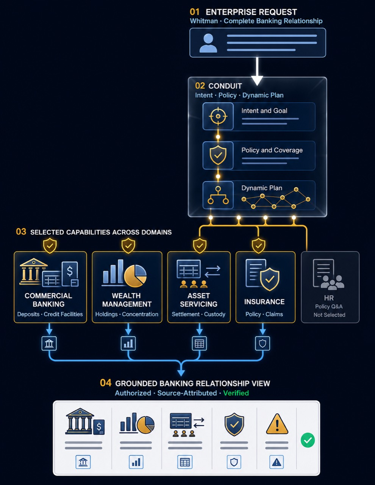
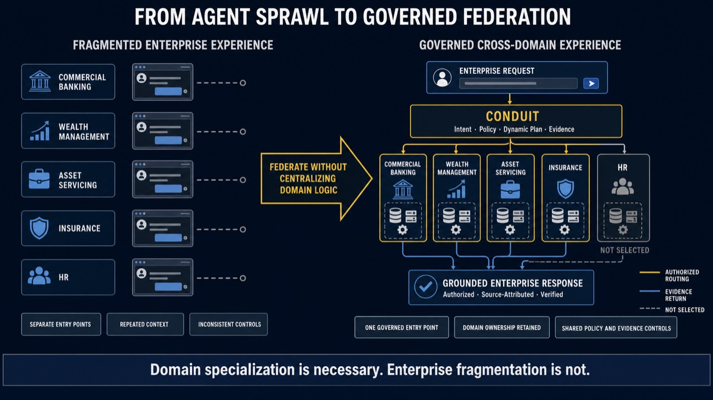
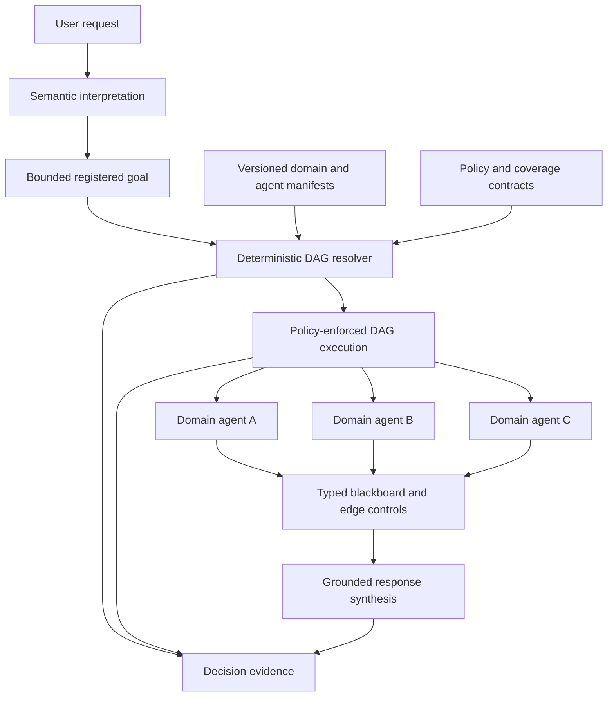
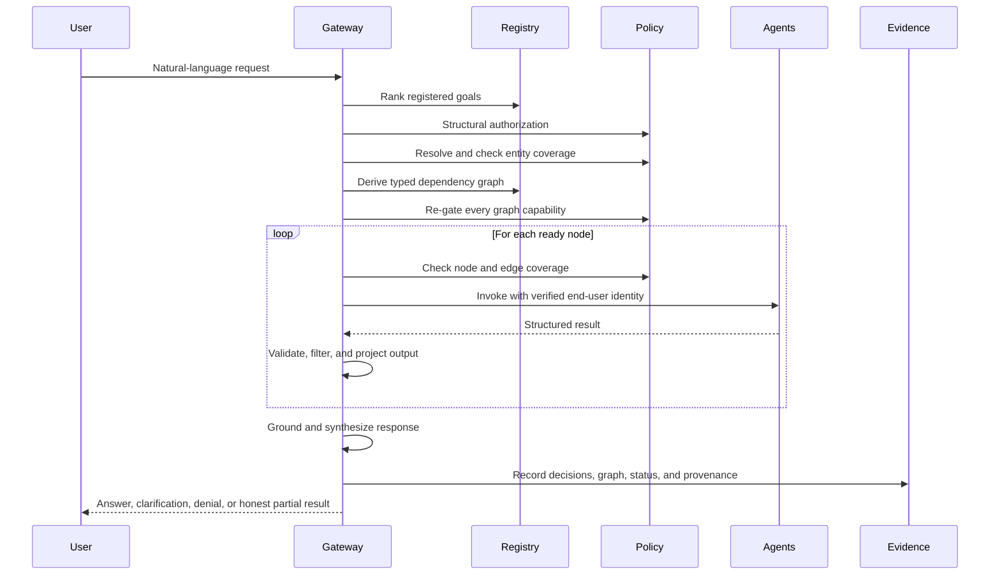
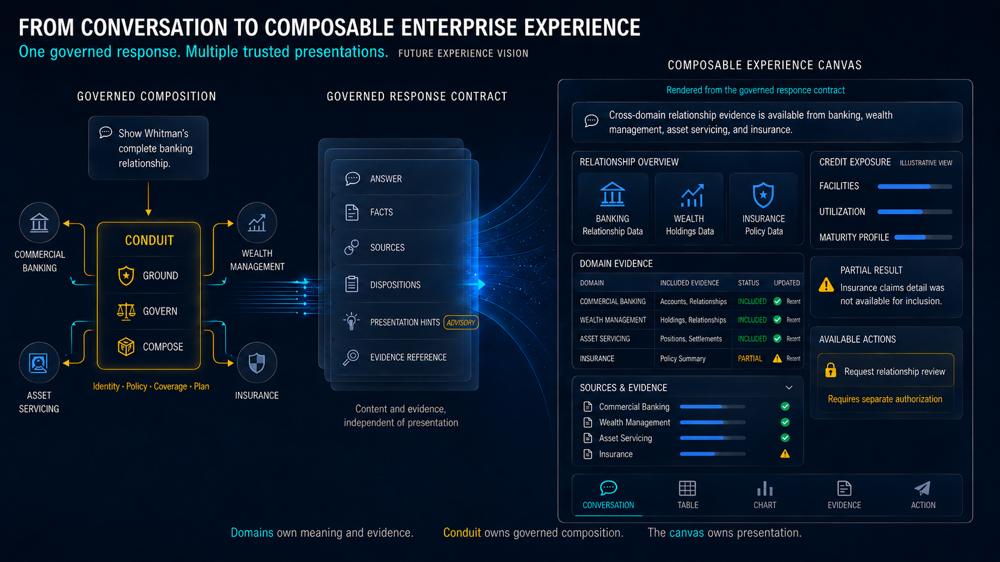
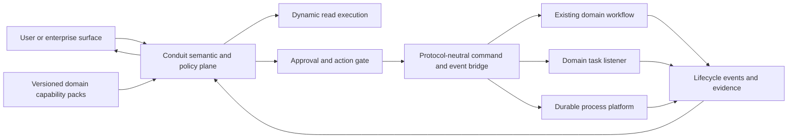

# Conduit: From Agent Sprawl to Governed Enterprise Intelligence

## A governed architecture for composing independently owned domain agents, data, policy, and workflows

**White Paper | Version 1.5 | July 2026**



*Figure 1. Illustrative banking scenario: Conduit coordinates selected capabilities across independently
owned domains and assembles the permitted evidence into a grounded relationship view.*

---

## Abstract

An enterprise can have hundreds of useful agents and still have no enterprise intelligence. The failure
appears when one question crosses the organizational chart: no single assistant owns the answer, no common
contract establishes how independently operated capabilities compose, and no shared control plane can
prove that every data access and decision was authorized.

Conduit addresses this gap through governed domain federation. Domain teams retain ownership of their
agents, data, policies, and workflows. They publish versioned executable contracts describing semantics,
authority, dataflow, and operational behavior. A probabilistic language layer interprets user intent;
deterministic software derives the admitted cross-domain plan, propagates identity, enforces structural and
entity-level authorization, filters data at graph boundaries, grounds the response, and records why every
decision occurred.

Today, Conduit applies this model to intelligent search and read-oriented cross-domain orchestration. The
same foundation provides a disciplined path to action: domain-owned tasks and existing workflows can later
be admitted as capabilities and coordinated through protocol-neutral command and event contracts. This
paper explains the architecture, implementation evidence, market alignment, scalability properties, and
roadmap for closing that loop without moving domain business logic into the gateway.

---

## Executive Summary

Every domain will build agents. That is the correct operating model. Wealth management should own wealth
agents. Insurance should own policy and claims agents. Asset servicing should own settlements and custody
agents. HR, legal, risk, finance, and operations should do the same. These teams understand their systems,
calculations, obligations, users, and failure modes better than a central AI platform team ever could.

The enterprise problem appears after those agents succeed.

Users encounter a growing collection of chatbots and copilots, each with its own interface, memory,
permissions, and partial view of the organization. They must know which assistant owns which question.
Context is repeated. Capabilities overlap. Controls vary. Cross-domain requests are returned to the user as
separate answers to reconcile manually.

Consider one apparently simple request:

> **"Give me the complete position for Whitman. Include portfolio concentration, unsettled trades,
> relevant insurance exposure, and anything that requires attention."**

No single chatbot owns that answer. Holdings and concentration belong to wealth management. Settlements
belong to asset servicing. Policies and claims belong to insurance. Identity determines who is asking.
Coverage services determine whether Whitman is in that person's current book. Classification policy
determines which capabilities may participate. Each domain has independent ownership, protocols, release
cycles, and controls.

The hard problem is not generating fluent prose. It is constructing the correct authorized computation
across those boundaries, then proving how it was constructed.

ChatGPT, Claude, Microsoft 365 Copilot, and custom enterprise assistants can provide excellent interaction
surfaces. Software development kits can build capable agents. Model Context Protocol (MCP) and Agent2Agent
(A2A) can connect them. Catalogs can make them discoverable. Gateways can secure their traffic. Workflow
engines can execute designed processes. None of those layers, by itself, establishes the semantic, policy,
ownership, compatibility, and evidence contracts required to compose independently owned domains safely
at request time.

Conduit is designed for that missing federation role.

> **Conduit does not centralize enterprise intelligence. It federates it.**

Domain teams keep their agents and implementation choices. Conduit provides the common contracts,
admission system, routing, deterministic plan construction, identity propagation, structural and
entity-level authorization, governed context, grounding, and decision evidence that allow those domains to
operate as one enterprise capability system.

The result is bounded autonomy: language intelligence where ambiguity exists, deterministic control where
the enterprise requires guarantees.

Conduit is intentionally starting with governed intelligent search. This earns the right to act: it proves
that routing, identity, authorization, entity coverage, cross-domain dataflow, grounding, and decision
evidence work before consequential writes are admitted. The longer-term destination is not a larger
chatbot. It is a closed enterprise loop from **ask**, to **understand**, to **read**, to **decide**, to
**approve**, to **act**, to **observe**, and finally to **explain**.

### The thesis at a glance

| Principle | Conduit position |
|---|---|
| Domain ownership | Domain teams build and operate domain intelligence and workflows. |
| Enterprise coordination | Conduit discovers, composes, authorizes, and explains capabilities across domains. |
| Bounded autonomy | Models interpret ambiguity; deterministic mechanisms control plans, policy, and data movement. |
| Evolution | Governed intelligent search comes first; declared, approved action follows on the same control foundation. |

---

## 1. The Gap Between Agent Success and Enterprise Intelligence

### 1.1 Local success creates systemic fragmentation

An individual agent is normally built for a bounded use case. Its team understands its prompts, tools,
data, risks, and expected behavior. Enterprise scale introduces a different operating model:

- users face many assistants and must discover the right one;
- agents are owned by different domains;
- domains use different protocols and data models;
- a single user request may legitimately span several domains;
- access depends on both identity and current business relationships;
- agent capabilities evolve independently;
- routing examples may overlap or conflict;
- context and memory become fragmented across applications;
- connectors and integrations are duplicated across teams;
- failures must not silently become incomplete or misleading answers;
- auditors and operators need to understand why a decision occurred.

This cannot be solved by placing every tool and instruction into one system prompt. As catalogs grow,
vocabulary collides, context expands, ownership blurs, and one team's change can alter another team's
routing behavior.

The answer is also not to stop domain teams from building agents. Centralizing domain logic would create a
new monolith, slow delivery, and separate business accountability from technical ownership. The enterprise
needs decentralized expertise and centralized control mechanisms at the same time.



*Figure 2. Governed federation preserves domain specialization while replacing fragmented entry points
with a coordinated enterprise experience. Domain systems remain independently owned.*

### 1.2 Interaction surfaces are not orchestration control planes

General assistants and copilots increasingly support connectors, tools, MCP servers, custom agents, and
administrative controls. They are valuable entry points into enterprise intelligence. But an interaction
surface should not be expected to become the enterprise's source of truth for cross-domain ownership,
business authorization, semantic compatibility, or execution evidence.

The correct relationship is complementary:

```text
ChatGPT / Claude / Microsoft Copilot / enterprise application
                              |
                              v
                           Conduit
       domain federation + deterministic orchestration + policy
            identity + coverage + evidence + governed context
                              |
                              v
       independently owned enterprise agents, tasks, and workflows
```

Users may keep the surface that best fits their work. Domain teams may keep the SDK and runtime that best
fit their capability. Conduit supplies the governed coordination fabric between them.

### 1.3 The market has built important layers, not the complete federation model

Three market layers have advanced rapidly:

| Market layer | What it solves | What remains for cross-domain federation |
|---|---|---|
| Build layer: SDKs and frameworks | Construct agents, tools, handoffs, state, and application graphs | Independent domain ownership, fleet admission, and common business contracts |
| Control layer: catalogs and gateways | Discovery, connectivity, identity, policy, inventory, and telemetry | Semantically correct composition and entity-aware dataflow across domains |
| Execution layer: workflows and supervisors | Predictable authored processes or flexible model-led delegation | Reuse of domain-owned workflows as governed capabilities alongside dynamic per-request plans |

These layers are essential and increasingly sophisticated. The remaining gap is the layer that turns a
catalog of independently owned capabilities into a valid, authorized cross-domain computation without
requiring a central team to author every possible workflow, rebuilding workflows that domains already
operate, or allowing a model to improvise consequential execution.

### 1.4 Three orchestration models define the 2026 design debate

The research and product market broadly organize around three models:

| Model | How execution is decided | Strength | Limitation |
|---|---|---|---|
| Model-led orchestration | An LLM selects tools, agents, sequence, and stopping behavior | Flexible for open-ended work | Variability in plan validity, policy adherence, cost, and replay |
| Deterministic authored workflow | A developer or process designer defines the graph | Predictable, testable, and durable | Expensive to author for combinatorial, cross-domain questions |
| Hybrid governed orchestration | Models interpret ambiguity; deterministic systems control execution | Balances language flexibility with enterprise control | Requires strong contracts, admission, and runtime enforcement |

Recent planning research explains why the hybrid is gaining attention. On the OrchDAG benchmark, exact
graph prediction pass@1 was reported at 15% for Claude 4 and 18% for GPT-4o in zero-shot evaluation, with
the best reported GPT-4o result reaching 24% with three examples.[1] A separate benchmark reported 97.85%
mean success for the Fast Downward planner and 63.44% for the strongest evaluated reasoning models.[2] A
2026 step-wise study reported 85.3% for classical planning, 63.7% for direct LLM planning, and 66.7% for
agentic LLM planning at substantially higher token cost.[3]

These results do not diminish the value of models. They clarify the boundary: use models for semantic
interpretation and open-ended reasoning; use deterministic systems for plan validity, authorization,
execution, and evidence.

### 1.5 The missing layer is governed domain federation

Conduit changes the unit of integration. The unit is not an application-specific tool call, one chatbot,
or a workflow embedded in gateway code. It is an independently owned, admission-tested domain capability
with an executable contract. A capability may be a read agent, deterministic service, task, or existing
domain workflow. The gateway interacts with the contract, not the domain implementation.

That leads to a distinct enterprise model:

> **Domain teams own their capabilities. Conduit federates them without absorbing their business logic
> into the gateway.**

The model selects a bounded destination from the admitted catalog. Conduit then derives the required
cross-domain graph from declared semantic contracts, applies policy and coverage throughout the dataflow,
executes the plan, grounds the result, and records the decision path.

---

## 2. Design Thesis

Conduit is built around five principles.

### 2.1 The model selects meaning, not execution truth

The semantic layer may classify intent and select from registered goal candidates. It does not emit
canonical business identifiers or an unrestricted execution graph. Every selected capability must already
exist in the admitted registry.

### 2.2 The graph is derived, not improvised

Capabilities declare what they consume and produce using semantic types. Starting from the selected goal,
the resolver walks backward through the catalog, finds required producers, validates entity inputs, rejects
missing or ambiguous dependencies, detects cycles, and topologically orders the plan.

The resulting directed acyclic graph (DAG) is dynamic per request but not open-ended. It can only contain
registered capabilities and declared relationships.

### 2.3 Policy is part of dataflow

Authorization is not a prompt instruction. It is enforced before data is fetched, when the resolver adds a
producer to the plan, before each node is dispatched, and when entity-typed data crosses a graph edge.

### 2.4 Domain knowledge and execution remain with domain owners

The gateway contains generic mechanisms rather than business-domain branches. Domain teams own agents,
tasks, workflows, entity semantics, coverage services, examples, expected behavior, and domain tests. The
platform owns the common contracts, admission process, policy integration, coordination mechanisms,
adapter framework, and evidence model. A payment workflow remains a payment-domain asset; Conduit may
select, authorize, trigger, correlate, and observe it, but does not reimplement it.

### 2.5 Every decision must be explainable

Operational telemetry is necessary but insufficient. The system must explain why it selected a goal,
which capabilities it considered, what policy allowed or denied, which graph it constructed, what data
crossed each boundary, what failed, and where important output values originated.

---

## 3. Current Reference Architecture: The Governed Read Plane

The current architecture turns a natural-language request into an authorized, typed, and observable
cross-domain computation. It is deliberately optimized for request-response work with no consequential
side effects.



### 3.1 Domain federation model

Conduit separates three contract levels:

| Contract | Responsibility |
|---|---|
| Domain manifest | Business domain identity, coverage endpoints, clarification policy, governed-memory policy |
| Sub-domain manifest | Entity vocabulary, required context, resource scoping, clarification behavior, capability membership |
| Agent manifest | Ownership, protocol, routing examples, access classification, SLA, semantic inputs and outputs, operational constraints |

At runtime, these contracts form an effective manifest for each capability. A new agent in an existing
sub-domain inherits the domain's entity and policy context. A new domain adds its own coverage and memory
contracts without requiring domain-specific gateway code.

The manifests are therefore more than registration metadata. They are the organizational agreement
between a domain team and the enterprise platform: what the capability means, who owns it, what it needs,
what it produces, who may use it, and how it can participate in a larger computation.

As the platform admits action capabilities, this hierarchy should evolve by composition rather than by
turning every agent manifest into a large workflow specification. A domain pack can contain sibling
capability declarations for agents, tasks, and workflows, with reusable references to schemas, policies,
events, tests, and ownership. This preserves one onboarding and admission model without pretending every
capability has the same runtime shape.

> **A catalog tells the enterprise what exists. An executable contract tells Conduit what can safely work
> together.**

### 3.2 Request lifecycle

Return to the Whitman request. Conduit does not send the full question to every available agent. It first
identifies the admitted goal capabilities expressed by the request. It resolves the human reference
"Whitman" to canonical business identifiers, checks whether the user may access those entities, and derives
the producer-consumer graph needed for the requested analysis. A concentration capability can require
holdings; an exposure view can involve insurance; an attention summary can include unsettled trades.

Each capability is authorized before dispatch. Each downstream dependency receives only declared,
coverage-filtered input. Independent work runs in parallel. Failed branches are represented honestly rather
than being silently replaced with invented context. The final response is assembled from source-attributed
results, with the decision path available for inspection.



### 3.3 Deterministic plan construction

The resolver treats semantic contracts like a build system treats dependencies:

1. Select an admitted goal capability.
2. Read its required entity and produced-input dependencies.
3. Match each required semantic type to exactly one admitted producer.
4. Recurse until dependencies terminate in resolved entities or source capabilities.
5. Reject missing producers, ambiguous producers, unknown nodes, and cycles.
6. Return a stable topological plan.

This model enables new valid compositions to emerge from registered contracts without allowing the model
to invent an execution path.

This is the critical middle ground between two costly extremes. The enterprise does not need to pre-author
every possible combination of wealth, servicing, insurance, risk, and operations. It also does not need to
trust a model to reconstruct those dependencies correctly on every request. Domain teams declare stable
capability relationships once; Conduit compiles the applicable plan when the request arrives.

### 3.4 Edge-level controls

Every producer-to-consumer edge is an enforcement boundary. Before data crosses the edge, Conduit can:

- project declared fields through a prevalidated expression;
- validate the projected shape against the consumer contract;
- identify manifest-declared entity values;
- check the user's current coverage for those entities;
- remove unauthorized values before counting or aggregation;
- evaluate deterministic predicates over already-filtered data;
- attach source and manifest provenance.

This is stronger than tool-level authorization because it governs both invocation and the movement of
business data discovered during execution.

---

## 4. Policy and Authorization Architecture

Cross-domain composition is useful only when authorization scales with it. A successful route is not an
authorization decision, and permission to invoke an agent is not necessarily permission to access every
entity that agent can reach.

### 4.1 Defense in depth

Conduit separates authorization into independent controls:

| Layer | Question |
|---|---|
| Ingress identity | Is the request associated with a valid, verified principal? |
| Structural policy | May this principal's role, segment, and clearance invoke this capability? |
| Entity resolution | Which canonical entity did the user reference? |
| Coverage policy | Is that entity currently within the principal's book or responsibility? |
| Plan re-gate | May every producer introduced by graph resolution participate? |
| Edge coverage | May each entity discovered during execution cross to the next consumer? |
| Per-hop identity | Did the downstream service verify the original end user? |
| Grounded output | Is each load-bearing presented figure attributable to declared source data? |

Structural authorization is enforced through an external policy decision point. Entity-level authorization
is owned by domain coverage services through `DISCOVER`, `RESOLVE`, and `CHECK` contracts. This separation
keeps current business relationships out of long-lived tokens and central gateway code.

### 4.2 Prune before retrieval

Unauthorized capabilities are removed before fan-out. Resource-scoped requests must pass coverage before
the corresponding data agent receives an entity ID. Resolver-added producers are re-authorized because
they may not have appeared in the original routed candidate set.

### 4.3 Filter before aggregation

Entities discovered inside an upstream result require runtime coverage checks. Unauthorized values are
filtered before downstream analytics can count, summarize, or otherwise infer information about them.
This treats coverage as row-level security on the execution graph rather than a one-time admission check.

For the Whitman request, this means a user may be structurally entitled to wealth, servicing, and insurance
capabilities while still being denied access to a particular relationship, account, policy, or entity
discovered during execution. Conduit applies those decisions before the data contributes to an aggregate or
reaches another domain.

### 4.4 Fail closed

Unresolved identifiers, unavailable coverage decisions, invalid signatures, missing policy context, and
ambiguous graph dependencies do not produce guessed execution. They result in denial, clarification, or a
reason-coded controlled outcome.

---

## 5. Four Banking Scenarios That Require Domain Federation

The following examples are deliberately selected because each exposes a different control boundary that a
single chatbot, catalog, or connector does not solve. They are illustrative architecture scenarios, not
legal conclusions. Conduit coordinates admitted capabilities and evidence; systems of record, approved
models, authorized analysts, and certified workflows retain their established authority. Client and
counterparty names are fictional.

### 5.1 A complete relationship view for an advisor

> **"Show me the complete position for Whitman: holdings, concentration, unsettled activity, relevant
> protection, and anything requiring attention."**

The request crosses wealth management, asset servicing, insurance, client master data, and relationship
coverage. The advisor may be entitled to use each business capability while lacking access to a particular
account, policy, or legal entity. The resulting analysis may also depend on current holdings being complete
before a concentration capability runs.

Conduit resolves the client reference, checks current relationship coverage, derives the required graph,
re-authorizes every participating capability, and filters entity-scoped data before it crosses domains. The
final response can explain which source supplied each material figure and which branch was unavailable.

**Why this example matters:** it demonstrates the everyday enterprise problem. One user intent spans
several legitimate domain owners, but no domain should surrender its systems, policy, or accountability to
a central chatbot.

### 5.2 Counterparty exposure during a stress event

> **"What is the bank's current exposure to Northstar Group if its credit quality deteriorates today?"**

A defensible answer may require lending facilities, derivatives exposure, collateral, treasury positions,
guarantees, settlement obligations, and the legal-entity hierarchy. These sources are typically owned by
different businesses and may represent exposure using different identifiers, currencies, timestamps, and
netting assumptions.

The Basel Committee developed BCBS 239 after observing that banks could not always aggregate risk
exposures and concentrations fully, quickly, and accurately. Its January 2026 implementation update again
emphasized accurate, comprehensive, and timely risk aggregation.[16]

Conduit does not replace the bank's risk engine or approved aggregation methodology. It can resolve the
requested counterparty to governed legal entities, invoke admitted source and risk capabilities, require
declared completeness and freshness, preserve source provenance, and refuse an aggregate when required
inputs are missing or unauthorized.

**Why this example matters:** it demonstrates that cross-domain orchestration is not only a convenience for
chat. It can become the controlled access path to risk evidence, where completeness and lineage are as
important as the final number.

### 5.3 AML investigation support without confidentiality leakage

> **"Assemble the evidence associated with this alert: relevant transactions, customer profile changes,
> sanctions results, prior cases, and unresolved questions."**

An authorized financial-crime analyst may need information from transaction monitoring, know-your-customer
(KYC) controls, sanctions, customer master data, payment systems, and case management. Those systems have
different owners and highly restricted audiences. The context passed between capabilities must be
minimized, and customer-facing or general-purpose assistants must never receive confidential investigation
material.

The Financial Crimes Enforcement Network (FinCEN) states that a Suspicious Activity Report (SAR), or
information revealing the existence of a SAR, is generally confidential and must not be disclosed to a
person involved in the reported activity. Institutions need policies and procedures that protect that
confidentiality.[18]

Conduit can restrict the goal to an admitted investigation capability, enforce analyst and case scope,
filter handoff context, preserve source and handoff provenance, and route any filing or escalation to an
existing approved workflow. The model may help organize authorized evidence; it does not decide whether to
file a SAR or disclose that one exists.

**Why this example matters:** it demonstrates why identity, destination restrictions, context filtering,
and decision evidence must follow the request through the graph rather than being applied only at login.

### 5.4 Credit decision support with specific reasons

> **"Summarize the approved decision inputs for this application and the specific reasons returned by the
> credit decision service."**

The supporting evidence may span application data, identity verification, income verification, bureau
data, fraud controls, collateral, policy rules, and an approved credit model. The LLM should not substitute
its own eligibility judgment or manufacture an explanation after the fact.

The CFPB has stated that creditors using complex algorithms, including AI or machine learning, must still
provide specific and accurate principal reasons for adverse action; technological complexity does not
remove that obligation.[17] The OCC's 2026 model-risk guidance addresses model development and use,
validation and monitoring, governance and controls, and third-party products.[19]

Conduit can route the request to the approved decision and reason-code services, enforce applicant and user
scope, preserve the exact factors returned by the authoritative system, and ground the explanation in those
factors. Model inventory, validation, fairness testing, and the decision itself remain with the bank's
approved governance and credit processes.

**Why this example matters:** it demonstrates the boundary between language assistance and decision
authority. Conduit can federate evidence and preserve reasons without turning generative text into the
credit decision system.

Together, these scenarios show four distinct reasons for cross-domain orchestration:

1. unified service across independently owned customer domains;
2. complete and timely risk evidence;
3. confidential, least-privilege investigation support;
4. explainable access to approved decision outputs.

The common requirement is not a larger prompt. It is a governed execution fabric.

---

## 6. Decision Observability

Conduit distinguishes infrastructure observability from decision observability.

Infrastructure observability answers whether a service was available, how long a call took, and how many
tokens were consumed. Decision observability explains system behavior:

- What intent and human references were extracted?
- Which goals were ranked, at what scores and margins?
- Which capabilities were withheld by structural policy?
- Which entity was resolved and why was coverage allowed or denied?
- What graph was constructed?
- Which nodes ran, failed, timed out, or were skipped?
- Which deterministic condition or map expansion changed execution?
- Why did the system abstain, clarify, deny, or fall back?
- Which source capability and field produced each important figure?

For a cross-domain answer, this is the difference between seeing that five services returned HTTP 200 and
understanding why the user received this particular answer. Conduit records the semantic and policy journey,
not only the network journey.

The evidence model serves several stakeholders:

| Stakeholder | Required explanation |
|---|---|
| User | Why was the answer denied, clarified, or incomplete? |
| Domain team | Why did the capability receive or not receive the request? |
| Operator | Where did latency, failure, or capacity pressure enter the graph? |
| Security team | Which identity, policy, and coverage decisions controlled data access? |
| Routing owner | Which capability displaced or poached the intended goal? |
| Auditor | Which versions, inputs, decisions, and sources produced the outcome? |

Operational replay is backed by structured trace events and plan-graph status. The target regulatory
evidence model binds those events to immutable registry snapshots, manifest hashes, policy-bundle hashes,
routing-index identity, bound-input hashes, and governed-memory watermarks in an append-only evidence
envelope.

---

## 7. Governed Multi-Turn Context

Enterprise memory should not be an ever-growing transcript passed back to a model. Conduit separates:

- an append-oriented event ledger;
- structured active entities and open questions;
- verified or expired access context;
- denied-entity markers without sensitive payloads;
- facts that must be preserved;
- volatile values that must be re-fetched;
- a non-authoritative narrative summary.

Compaction policy is declared by the domain and owned by a separate memory service. Authorization is
rechecked when fresh data is requested; remembered access is not treated as permanent authority. This
allows conversations to remain coherent without turning historical prose into a security boundary.

The ledger remains canonical. A compacted summary is a derived, replaceable projection over an explicit
ledger interval, with a watermark recording what has been summarized. New events are appended rather than
rewriting history. This supports entity-aware compaction across long conversations while preserving the
ability to explain which source turns, policy state, and summary version informed a later request.

---

## 8. Scaling Across Domains

### 8.1 Organizational scale

Domain teams need not understand or modify the central gateway. They provide:

- the capability and protocol endpoint;
- business ownership;
- entity and coverage semantics;
- routing examples and held-out test cases;
- classification and authority requirements;
- expected behavior under allow, deny, ambiguity, and failure.

The platform compiles these inputs into registry artifacts, validates the live service, runs admission
tests, and promotes an immutable version.

### 8.2 Runtime scale

At fleet scale, the registry should compile immutable snapshots containing:

- capability lookup by ID;
- producer lookup by semantic type;
- domain and sub-domain candidate sets;
- prevalidated graph relationships;
- protocol-derived wire schemas;
- routing-index and embedding-model identity;
- policy and manifest hashes;
- admission status.

The semantic router first narrows the request to the relevant domains. DAG resolution then operates over
the reachable domain-scoped graph rather than the entire enterprise fleet. Independent nodes execute in
parallel under per-capability bulkheads, circuit breakers, service-level limits, and an overall request
deadline.

### 8.3 Contract scale

Semantic types should be namespaced, owned, and major-versioned. Compatibility is validated at admission.
Where translator relationships begin approaching quadratic growth, a governed canonical data model can
reduce mappings to one pair per capability and canonical type.

### 8.4 Read and action separation

Dynamic request-response composition is appropriate for read-oriented, idempotent work. Consequential
actions should route by default to certified, domain-owned workflows with approvals, idempotency,
compensation, and human intervention. One semantic entry point may select both classes, but execution
authority remains separate.

This is not a preference for one workflow product. A business-process platform, IT service-management
system, cloud state machine, event consumer, or internal process platform can all sit behind an admitted
adapter. In many enterprises, the safest and fastest path is to reuse the workflows that domain teams
already operate. Those workflows contain accumulated business rules, operational ownership, recovery
procedures, and approvals that should not be reconstructed inside an AI gateway.

Dynamic orchestration remains valuable. Conduit can continue to derive read graphs at request time and may
eventually construct a candidate action workflow from admitted building blocks. A dynamically constructed
write workflow, however, should be treated as a compiled artifact: schema-checked, policy-checked,
simulation-tested, versioned, and admitted before consequential execution. Generation is an option;
unreviewed deployment is not the default.



*Figure 3. Future experience vision: domains own meaning and evidence, Conduit owns governed composition,
and an independent canvas owns presentation. Actions remain subject to separate authorization.*

### 8.5 Closing the loop through declared execution contracts

The destination is a protocol-neutral coordination model, not a workflow engine inside the gateway.
Conduit interprets a goal, resolves admitted capabilities, enforces policy, and coordinates progress. The
domain performs the work. Commands leave through generic adapters; accepted, progress, completion,
failure, cancellation, and compensation events return through a common lifecycle contract.



The domain onboarding contract declares what Conduit needs to coordinate safely, without embedding domain
logic in gateway code:

| Declaration | Purpose |
|---|---|
| Capability identity and semantics | Make the task or workflow discoverable from business intent |
| Input, output, command, and event schemas | Validate every boundary and support compatibility checks |
| Adapter and destination reference | Select a generic transport without hard-coding a domain integration |
| Authorization action and risk class | Separate permission to read, propose, approve, and execute |
| Approval and segregation-of-duties policy | Identify who must decide before a consequential action proceeds |
| Idempotency, timeout, cancellation, and compensation | Define safe behavior under retries, delay, and partial failure |
| Lifecycle event mapping | Normalize domain-specific progress into a common task state model |
| Ownership, version, tests, and evidence requirements | Preserve accountability and make admission reproducible |

Human approval is a policy event, not merely a confirmation button. An approval should bind the actor,
proposed action, affected entities, validated parameters, expected impact, supporting evidence, policy and
capability versions, expiration, and approver decision. Authorization and relevant business conditions are
checked again immediately before dispatch because they may change while a task waits. The contract defines
the required control; the selected adapter and domain execution system determine how the wait, decision,
and resumption are implemented.

The conversation ledger remains the user's continuity and correlation surface. It is not the authoritative
state store for a domain workflow. The owning workflow or process system remains the execution source of
truth, while Conduit maintains a governed projection sufficient to coordinate dependencies, notify users,
and explain what happened.

---

## 9. Onboarding as an Admission System

Manifests are effective machine contracts but can become an adoption burden if every domain team must learn
the entire platform schema. Conduit therefore treats onboarding as a separate control-plane capability.

### 9.1 Guided onboarding agent

The onboarding agent interviews the domain team in business language, inspects OpenAPI, MCP, or A2A
interfaces, drafts the applicable manifests, proposes realistic routing examples, identifies missing
coverage semantics, and assembles a test dataset.

### 9.2 Deterministic compiler and validators

The onboarding agent is not the production authority. Its output passes through:

- schema validation;
- protocol introspection;
- semantic contract and graph validation;
- routing collision and held-out generalization tests;
- structural policy tests;
- coverage conformance tests;
- identity and failure tests;
- human approval for classification, coverage semantics, and consequential authority.

### 9.3 Domain pack

The promoted artifact is a versioned domain pack containing capability manifests, schemas, routing
examples, held-out goldens, authorization cases, coverage tests, admission results, ownership, and content
hashes. As action support is introduced, the same pack can reference domain-owned task and workflow
contracts, command and lifecycle-event schemas, approval policies, idempotency behavior, and compensation
capabilities. The onboarding experience grows; the gateway's domain-specific code does not.

This changes onboarding from prompt engineering into a governed labeling and verification process. Domain
experts provide the truth only they know; the platform supplies the compiler and measurable gate.

---

## 10. Market Alignment and Differentiation

### 10.1 Independent signals of convergence

Conduit's market thesis does not depend on one vendor roadmap. It is supported by several independent
movements that are converging on the same enterprise architecture:

| Industry signal | External evidence | Implication for Conduit |
|---|---|---|
| Fragmented agent estates require a control plane | Forrester describes an agentic-control-plane category for governing fragmented agent estates and keeping agents observable and accountable.[22] | Agent proliferation creates an enterprise coordination problem after local agents succeed. |
| Domain ownership and cross-domain governance must coexist | Deloitte identifies the governance challenge created when agents cross domain-platform trust boundaries and describes a federated architecture that retains local agents within their domain platforms.[23] | Domain teams should keep their agents; cross-domain trust requires a separate federation layer. |
| Interoperability is becoming shared infrastructure | The Linux Foundation reported more than 150 organizations supporting A2A, including integration across major cloud platforms.[20] | Open protocols increase reach, but common transport does not replace semantic, policy, or ownership contracts. |
| Registries are evolving into control layers | AWS describes the enterprise agent registry as an authoritative control layer for capability, ownership, identity, policy, compliance, and observability.[24] | A catalog becomes operationally useful when registration is tied to admission and governance. |
| Governance must reflect autonomy and risk | Gartner warns against uniform governance across agents and recommends controls based on autonomy level and scope.[21] | Read, advisory, and consequential capabilities require different controls and execution authority. |
| Enterprise value comes from coordinated systems | PwC describes an agentic enterprise as coordinated agents performing end-to-end work with governance, oversight, shared knowledge, and audit trails.[25] | The enterprise outcome matters more than the success of an isolated agent. |
| Hybrid execution is replacing all-model orchestration | OpenAI, Google, Microsoft, Anthropic, and LangGraph distinguish open-ended model reasoning from predictable code, graph, or workflow control.[4][5][6][7][9] | Dynamic interpretation and deterministic execution are complementary rather than competing choices. |

These signals validate the direction without implying that the market has already standardized on one
implementation. The emerging consensus is architectural: distributed capabilities, open interoperability,
central control mechanisms, risk-sensitive governance, and hybrid execution. Conduit's distinctive move is
to combine those ideas at the cross-domain semantic and dataflow layer.

### 10.2 Application SDKs and domain federation are different layers

Agent SDKs help a team implement an agent or orchestrated application. They do not automatically establish
enterprise ownership, cross-domain policy, entity coverage, fleet admission, or compatibility contracts.

Conduit sits above SDK choice. A domain capability may be built with OpenAI Agents SDK, Google ADK,
LangGraph, Microsoft Agent Framework, custom code, or a deterministic service. Conduit registers and
governs the capability through HTTP, MCP, or A2A without requiring the central gateway to adopt the domain
team's implementation framework.

### 10.3 Competitive context

The market contains increasingly comprehensive agent control planes:

- AWS AgentCore combines gateway, policy, identity, registry, memory, observability, and evaluation.[8]
- MuleSoft Agent Fabric combines a cross-vendor registry, Agent Broker, gateway governance, identity, and
  observability.[10]
- IBM watsonx Orchestrate combines a governed catalog, deterministic workflows, agent-led orchestration,
  promotion, and a centralized control plane.[11]
- Salesforce describes registry, broker, gateway, and visualizer as core Agentforce architecture pillars.[12]
- Microsoft Agent 365 and ServiceNow AI Control Tower focus on enterprise-wide discovery, identity, risk,
  and governance.[13][14]
- Camunda combines deterministic process orchestration with bounded agentic sections.[15]

Conduit does not claim that these primitives are individually unique. Its differentiation is their
composition:

> Independently owned domains submit executable contracts. A model selects a bounded goal. The platform
> deterministically compiles the cross-domain plan, enforces identity and entity-level policy throughout
> execution, grounds important outputs, and records why each decision occurred.

Adjacent products overlap with important parts of this model. The differentiation is not one isolated
primitive. It is the operating model created by combining typed per-request graph derivation, domain-owned
coverage contracts, produced-entity edge filtering, domain-independent gateway logic, fleet admission,
and a path to existing domain workflows. Across the public product documentation reviewed for this paper,
that complete combination was not presented as a single cross-domain architecture. This is architectural
positioning, not a claim about private implementations or patent novelty.

---

## 11. Implementation Evidence

Conduit currently demonstrates the following capabilities:

| Area | Current evidence |
|---|---|
| Domain independence | Static checks report no business-domain coupling in gateway mechanisms |
| Manifest contracts | Domain, sub-domain, and agent schemas with registry validation and protocol introspection |
| Deterministic planning | Typed backward resolution, cycle detection, missing/ambiguous dependency refusal, stable topological order |
| Resolver assurance | Random-graph oracle, permutation, metamorphic, adversarial, mutation, real-manifest, and scale tests |
| Dataflow execution | Dependency-aware execution, typed projection, deterministic conditions, bounded maps, partial-failure handling |
| Identity | Verified caller identity propagated through flat and DAG agent hops |
| Authorization | Structural policy plus request, node, and produced-entity coverage enforcement |
| Grounding | Manifest-declared figures, deterministic substitution, attribution validation, deterministic fallback |
| Observability | Routing, policy, coverage, graph, node, condition, map, grounding, and completion events |
| Multi-turn context | Ledger-backed governed context and domain compaction policy |

---

## 12. Architectural Assessment

For enterprise orchestration, state-of-the-art thinking is not a feature count. It is the disciplined use
of probabilistic intelligence where interpretation is valuable and deterministic control where the
enterprise needs guarantees, with evidence at the boundary between them.

By that standard, Conduit's architectural thinking is state of the art because it:

- minimizes the model's execution authority;
- derives dynamic plans from admitted typed contracts;
- treats authorization as an execution and dataflow invariant;
- preserves end-user identity across agent boundaries;
- separates domain ownership from central runtime mechanisms;
- makes important output attribution enforceable;
- treats routing quality as an admission concern;
- builds decision explanation into the runtime.

Conduit implements this posture across routing, graph derivation, authorization, dataflow, grounding,
memory, and decision evidence. Today, the implementation is centered on governed intelligent search and
read-oriented cross-domain orchestration. The forward architecture extends the same federation model to
declared domain tasks and existing workflows through policy-enforced, event-driven coordination.

---

## Conclusion

The enterprise agent problem is not solved by choosing a more capable model or by connecting more tools.
It requires a control plane that can federate independently owned domains without surrendering execution
authority, policy, or accountability to a probabilistic component.

Conduit provides that control model. It lets language models interpret language while deterministic
software determines what is allowed, what must run, how data may move, and what evidence must remain. Its
manifest hierarchy allows domain teams to retain ownership while participating in a common enterprise
runtime. Its policy and coverage model carries authorization through the graph rather than checking only
at the perimeter. Its observability model explains decisions rather than merely recording calls.

This combination positions Conduit as more than an agent SDK, workflow engine, or AI gateway. It is a
governed domain-federation layer for enterprise intelligence.

Its present value is intelligent search that can assemble an authorized answer across independently owned
domains. Its larger value is the ability to close the loop without centralizing domain execution. The same
request can eventually move from understanding and evidence gathering to a declared approval and an
existing domain-owned workflow, then return progress and outcome evidence to the user. Conduit becomes the
coordinator of enterprise capability, while domains remain the owners of enterprise action.

---

## Appendix A: Forward Roadmap

The roadmap extends the control model in three deliberate horizons. It does not require a change in the
platform thesis or a migration of domain logic into Conduit.

### Horizon 1: Prove the read plane at fleet quality

- Raise admission from domain-level routing accuracy to exact leaf-capability and analytics-goal accuracy.
- Promote registry, routing, schema, policy, and model identity as one immutable snapshot.
- Bind traces to content-addressed, append-only evidence for replay and audit.
- Capture reproducible evidence for identity, allow and deny behavior, failure, grounding, and scale.
- Extend scheduling with dependency-ready release and critical-path deadline allocation.

### Horizon 2: Make domain onboarding a product

- Productize the guided onboarding agent and deterministic domain-pack compiler.
- Enforce namespaced, owned, and major-versioned semantic types.
- Automate routing-collision, policy, coverage, protocol, failure, and golden-dataset admission tests.
- Give domain teams clear diagnostics without requiring them to understand gateway internals.

### Horizon 3: Close the loop from intelligence to action

- Add sibling task and workflow contracts to domain packs without turning agent manifests into workflow
  definitions.
- Introduce protocol-neutral command and lifecycle-event adapters with correlation, idempotency,
  cancellation, and compensation requirements.
- Add policy-bound human approval, segregation of duties, and authorization revalidation before dispatch.
- Admit existing domain-owned workflows as the default action path.
- Evaluate dynamically compiled action workflows later under simulation, versioning, and explicit
  admission controls.

Each horizon compounds the previous one. Better admission strengthens search. Better contracts make
onboarding scalable. Proven identity, policy, evidence, and domain ownership make consequential action a
controlled extension rather than a reinvention.

---

## References

1. Lu, Y., Liu, S., and Dong, L. *OrchDAG: Complex Tool Orchestration in Multi-Turn Interactions with Plan DAGs.* Amazon Science, 2025. [Paper](https://assets.amazon.science/cf/40/d2e7baf0437385eba4505d0453bc/cam-ready-118-orchdag-complex-tool-orche.pdf)
2. Goebel, K., and Zips, P. *Can LLM-Reasoning Models Replace Classical Planning? A Benchmark Study.* 2025. [arXiv:2507.23589](https://arxiv.org/abs/2507.23589)
3. Göbel, K., Lorang, P., Zips, P., and Glück, T. *Agentic LLM Planning via Step-Wise PDDL Simulation: An Empirical Characterisation.* 2026. [arXiv:2603.06064](https://arxiv.org/abs/2603.06064)
4. OpenAI. *Agent orchestration, OpenAI Agents SDK.* [Documentation](https://openai.github.io/openai-agents-python/multi_agent/)
5. Google. *Why we built ADK 2.0.* July 2026. [Google Developers Blog](https://developers.googleblog.com/why-we-built-adk-20/)
6. Microsoft. *Workflows, Microsoft Agent Framework.* 2026. [Documentation](https://learn.microsoft.com/en-us/agent-framework/journey/workflows)
7. Anthropic. *Building Effective Agents.* December 2024. [Article](https://www.anthropic.com/engineering/building-effective-agents)
8. Amazon Web Services. *Policy in Amazon Bedrock AgentCore* and *AgentCore FAQs.* [Policy documentation](https://docs.aws.amazon.com/bedrock-agentcore/latest/devguide/policy.html), [AgentCore overview](https://aws.amazon.com/bedrock/agentcore/faqs/)
9. LangChain. *LangGraph Overview.* [Documentation](https://docs.langchain.com/oss/python/langgraph/overview)
10. MuleSoft. *Agent Fabric Overview.* 2026. [Documentation](https://docs.mulesoft.com/general/agent-fabric-overview)
11. IBM. *watsonx Orchestrate Agentic Orchestration.* 2026. [Product documentation](https://www.ibm.com/products/watsonx-orchestrate/multi-agent-orchestration)
12. Salesforce. *Agentforce Architecture Fundamentals.* 2026. [Architecture documentation](https://architect.salesforce.com/docs/architect/fundamentals/guide/get-started-agentforce.html)
13. Microsoft. *Agent365: The Identity-First Control Plane for Scalable AI Agents.* May 2026. [Microsoft Community Hub](https://techcommunity.microsoft.com/blog/agent-365-blog/agent365-the-identity-first-control-plane-for-scalable-ai-agents/4519921)
14. ServiceNow. *AI Control Tower.* [Product documentation](https://www.servicenow.com/uk/products/ai-control-tower.html)
15. Camunda. *Agentic Orchestration.* 2026. [Product documentation](https://camunda.com/de/solutions/agentic-orchestration/)
16. Basel Committee on Banking Supervision. *Principles for effective risk data aggregation and risk reporting* and *Implementation of the BCBS 239 Principles.* [BCBS 239](https://www.bis.org/publ/bcbs239.htm), [January 2026 implementation update](https://www.bis.org/publ/bcbs_nl36.htm)
17. Consumer Financial Protection Bureau. *Consumer Financial Protection Circular 2022-03: Adverse action notification requirements in connection with credit decisions based on complex algorithms.* [CFPB Circular](https://www.consumerfinance.gov/compliance/circulars/circular-2022-03-adverse-action-notification-requirements-in-connection-with-credit-decisions-based-on-complex-algorithms/)
18. Financial Crimes Enforcement Network. *Sharing Suspicious Activity Reports by Depository Institutions with Certain U.S. Affiliates.* FIN-2010-G006. [FinCEN Guidance](https://www.fincen.gov/resources/statutes-regulations/guidance/sharing-suspicious-activity-reports-depository-institutions)
19. Office of the Comptroller of the Currency. *Model Risk Management: Revised Guidance.* OCC Bulletin 2026-13. [OCC Guidance](https://occ.gov/news-issuances/bulletins/2026/bulletin-2026-13.html)
20. Linux Foundation. *A2A Protocol Surpasses 150 Organizations, Lands in Major Cloud Platforms, and Sees Enterprise Production Use in First Year.* April 2026. [Announcement](https://www.linuxfoundation.org/press/a2a-protocol-surpasses-150-organizations-lands-in-major-cloud-platforms-and-sees-enterprise-production-use-in-first-year)
21. Gartner. *Applying Uniform Governance Across AI Agents Will Lead to Enterprise AI Agent Failure.* May 2026. [Press release](https://www.gartner.com/en/newsroom/press-releases/2026-05-26-gartner-says-applying-uniform-governance-across-ai-agents-will-lead-to-enterprise-ai-agent-failure)
22. Forrester. *The Agentic Control Plane Solutions Landscape, Q2 2026.* June 2026. [Report overview](https://www.forrester.com/report/the-agentic-control-plane-solutions-landscape-q2-2026/RES197170)
23. Deloitte. *Federated AI Architectures.* June 2026. [Perspective](https://www.deloitte.com/nl/en/services/consulting/perspectives/ai-architectures.html)
24. Amazon Web Services. *Enterprise Agent Registry: The Control Plane for Governed AI at Scale.* June 2026. [AWS Builder Center](https://builder.aws.com/content/3FayIMFmGFNotW2VhTDFRPeH5Ea/enterprise-agent-registry-the-control-plane-for-governed-ai-at-scale)
25. PwC. *Scaling AI with Agentic Architecture.* June 2026. [Perspective](https://www.pwc.com/us/en/intelligent-enterprise/scaling-the-agentic-enterprise.html)

---

### Document Note

This paper describes Conduit's architecture and market position as of July 2026. Product and
third-party capability descriptions are based on publicly available documentation reviewed on 2026-07-10.
No statement in this paper should be interpreted as a patentability, legal, regulatory, or independent
certification opinion.
