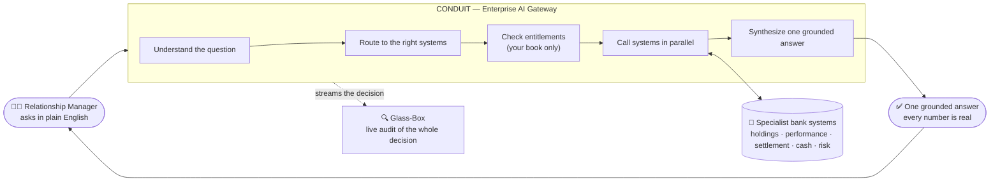
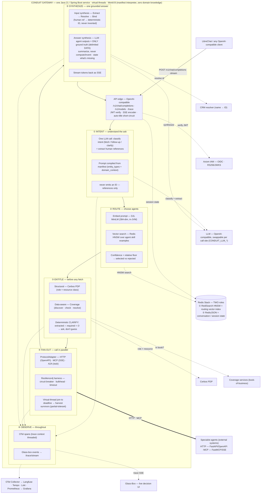
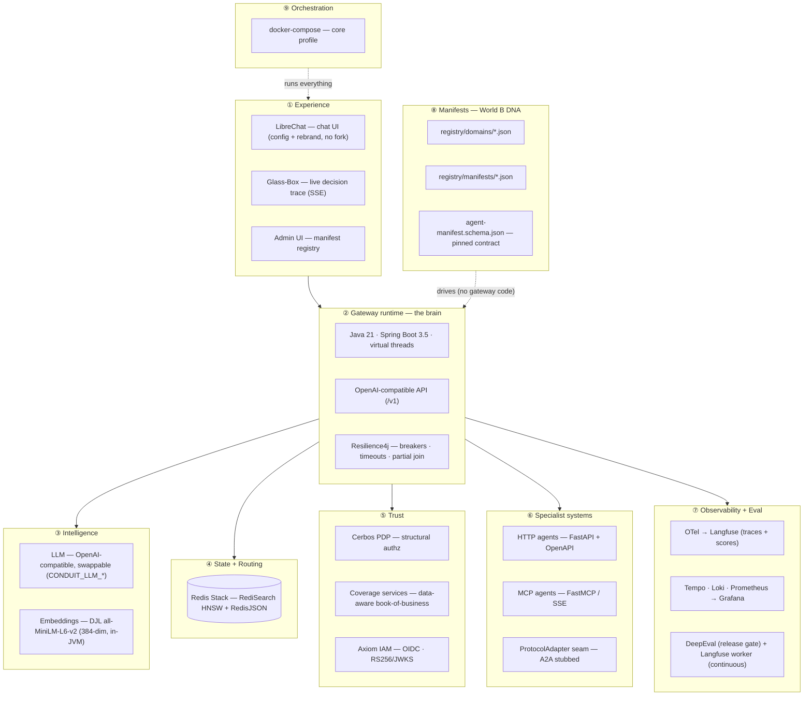

# Conduit — Diagram Prompts & Generation Guide

> Everything you need to generate three diagrams — **(1) high-level/executive, (2) technical
> architecture, (3) technical stack** — reliably and repeatably. For each diagram you get a
> ready-to-render **Mermaid** block (the source of truth) and a **natural-language prompt** (for
> AI diagram tools). Read the generation guide first — *how* you render matters more than the prompt.

---

## How to get these generated e2e — with confidence levels

The honest truth about diagram generation for **technical** content:

| Method | Best for | Fidelity confidence | Why |
|---|---|---|---|
| **Mermaid** (code → GitHub / mermaid.live / Mermaid Chart) | all 3 | **~95%** ✅ | Deterministic. Same input → same output, every time. Renders in the repo. Edits are surgical. **Use this as the source of truth.** |
| **Eraser.io** (diagram-as-code or its AI) | arch + stack, pretty slides | **~90%** | Beautiful cloud-architecture aesthetics; great for exec decks. Needs an account; AI mode occasionally re-labels. |
| **D2 / Graphviz** | dense architecture | **~88%** | Precise, great auto-layout; less polished look. |
| **Excalidraw** (text-to-diagram, MCP) | high-level / hand-drawn exec look | **~70%** | Charming sketch style; expect manual nudging of layout. |
| **AI image generators** (DALL·E, Midjourney, "Nano Banana", etc.) | a *hero illustration* only | **~25–35%** ❌ | They **garble text, miscount boxes, and invent connections.** Never use for an accurate technical diagram. Fine for a glossy cover image with no real labels. |

**The recommended e2e workflow (≈95% you get it perfect on the first or second try):**

1. **Render the Mermaid blocks below** — paste into <https://mermaid.live> or just commit them; GitHub
   renders Mermaid natively. This *is* your diagram. ~95% perfect immediately; the other ~5% is
   minor layout taste (left-right vs top-down, spacing) which you tune by editing the code.
2. **For a polished slide**, paste the *same structure* into **Eraser.io** (or feed it the
   natural-language prompt). Keep the Mermaid as the canonical version in the repo so it never drifts.
3. **Never** send the technical two (architecture, stack) to an image generator. Only consider one
   for a decorative cover.

> Tip: tune Mermaid layout with `flowchart LR` (wide, slide-friendly) vs `flowchart TB` (tall,
> doc-friendly), and group with `subgraph`. That's 90% of "making it look right."

I can also **render these for you right now** via the Mermaid Chart / Eraser / Excalidraw MCP tools
— just say which and I'll produce the image.

---

## Diagram 1 — High-Level (executive / conceptual)

**Goal:** the story in one glance for a product owner — *one question in, one grounded answer out,
entitlement-checked, fully auditable.* Few boxes, no jargon.

### Mermaid (source of truth)

### Natural-language prompt (for an AI diagram tool)
> Create a clean, executive-level left-to-right flow diagram titled "Conduit — Enterprise AI
> Gateway." On the left, a person labeled "Relationship Manager — asks in plain English." An arrow
> into a large rounded container labeled "CONDUIT — Enterprise AI Gateway" that contains five
> stacked steps: "Understand the question" → "Route to the right systems" → "Check entitlements
> (your book only)" → "Call systems in parallel" → "Synthesize one grounded answer." A double-headed
> arrow connects "Call systems in parallel" to a cylinder labeled "Specialist bank systems —
> holdings, performance, settlement, cash, risk." An arrow leaves the container to a rounded box
> "One grounded answer — every number is real," which loops back to the Relationship Manager. A
> dotted arrow goes from the container down to a box "Glass-Box — live audit of the whole decision."
> Minimal, modern, lots of whitespace, no technical jargon, muted enterprise palette (navy/slate +
> one accent).

---

## Diagram 2 — Technical Architecture (internals / mechanisms)

**Goal:** for engineers — **how the gateway actually works inside.** Each of the six stages is
*opened up to its mechanism*, not just named:
- **Intent** = one LLM call that classifies *and* extracts human references (manifest-compiled
  prompt, never emits an ID).
- **Route** = DJL MiniLM embed → Redis **HNSW** vector search → confidence floor → selected vs
  rejected agents.
- **Entitle** = Cerbos structural check **+** coverage data-aware book check **+** deterministic
  clarify (`extracted ∩ required = ∅`).
- **Fan-out** = ProtocolAdapter (HTTP/MCP) wrapped in the **Resilience4j harness** (circuit breaker
  · bulkhead · timeout) with a virtual-thread **partial join to deadline**.
- **Synthesize** = input synthesis (Extract→Resolve→Bind) + grounded LLM (agent outputs are the
  *only* ground truth), streamed as SSE.

Two deliberate changes from the first version: **Redis's two distinct roles** are spelled out, and
the **specific business agents are made generic** — this is the *architecture*, not the domain mix.

### Mermaid (source of truth)

### Natural-language prompt (for an AI diagram tool)
> Create a **detailed technical "how it works inside" architecture diagram** (a component/mechanism
> diagram, not a high-level context diagram), top-to-bottom, clean enterprise style. This must
> showcase the *internal mechanisms*, not just box names. Keep business/domain specifics generic
> (do NOT name wealth/insurance agents) — this is the architecture.
>
> Top: a box "LibreChat / any OpenAI-compatible client" with an arrow labeled "POST
> /v1/chat/completions (stream)" into a large container titled "CONDUIT GATEWAY — one Java 21 /
> Spring Boot service · virtual threads · World B (manifest interpreter, zero domain knowledge)".
>
> Inside the gateway, first an "API edge" box (OpenAI-compatible: /v1/chat/completions, /v1/models,
> /trace; JWT verify; SSE encoder; auto-title short-circuit), then a vertical pipeline of six
> **expanded** stages, each drawn as its own sub-box containing its mechanism bullets:
> - "① INTENT — understand the ask": *one LLM call that classifies intent (fetch / follow-up /
>   clarify) AND extracts human references; prompt compiled from the manifest (entity_types +
>   domain_context); never emits an ID — references only.*
> - "② ROUTE — choose agents": *embed the prompt with DJL MiniLM (384-dim, in-JVM) → vector search
>   over agent skill examples in Redis HNSW → confidence + relative floor → selected vs rejected
>   agents.*
> - "③ ENTITLE — before any fetch": *structural check via Cerbos PDP (role × resource class) +
>   data-aware check via Coverage services (discover/check/resolve the user's book) + deterministic
>   CLARIFY when extracted ∩ required = ∅ (ask, don't guess).*
> - "④ FAN-OUT — call in parallel": *ProtocolAdapter (HTTP/OpenAPI · MCP/SSE · A2A stub) wrapped in
>   a Resilience4j harness (circuit breaker · bulkhead · timeout); virtual-thread join to a deadline
>   that harvests survivors (partial-result tolerant).*
> - "⑤ SYNTHESIZE — one grounded answer": *input synthesis Extract→Resolve→Bind (human reference →
>   deterministic ID, never invented); answer synthesis by LLM where agent outputs are the ONLY
>   ground truth (delimited DATA) — summarize, never compute/invent, state what's missing; stream
>   tokens back as SSE.*
> - "⑥ OBSERVE — throughout": *OTel spans with trace context threaded; glass-box events to
>   /trace/stream.*
> The API edge returns an "SSE answer" arrow back to the client.
>
> Around the gateway, generic supporting infrastructure nodes with **explanatory labels**:
> - "LLM — OpenAI-compatible, swappable per call site (CONDUIT_LLM_*)" — dotted arrows from INTENT
>   ("classify + extract") and SYNTHESIZE ("synthesize").
> - "Redis Stack — TWO roles: ① RediSearch HNSW = routing vector index, ② RedisJSON = conversation /
>   session state" (draw as a cylinder) — dotted arrow from ROUTE ("HNSW search") and from the API
>   edge ("session state"). **Make Redis's dual role explicit.**
> - "Cerbos PDP" and "Coverage services (book-of-business)" — dotted arrows from ENTITLE
>   ("role × resource" and "in book?").
> - "CRM resolver (name → ID)" — dotted arrow from SYNTHESIZE ("resolve id").
> - "Axiom IAM — OIDC · RS256/JWKS" — dotted arrow from the API edge ("verify JWT").
> - "Specialist agents (external systems) — HTTP FastAPI/OpenAPI · MCP FastMCP/SSE" — a thick arrow
>   from FAN-OUT labeled "HTTP · MCP".
> - "Glass-Box — live decision UI" and "OTel Collector → Langfuse · Tempo · Loki · Prometheus →
>   Grafana" — dotted arrows from OBSERVE.
>
> Use **solid lines for the request path**, **thick lines for external agent calls**, and **dotted
> lines for verification / side-calls / telemetry**. Emphasize the four mechanisms reviewers care
> about: the single classify+extract LLM call (INTENT), the embed→HNSW→floor routing, the
> Resilience4j harness + partial join (FAN-OUT), and Extract→Resolve→Bind + grounded synthesis.

---

## Diagram 3 — Technical Stack (layered)

**Goal:** for architects/platform — the layered technology choices, grouped by concern, with the
manifests called out as the World-B "DNA" that drives the gateway.

### Mermaid (source of truth)

### Natural-language prompt (for an AI diagram tool)
> Create a layered technology-stack diagram, top-to-bottom, each layer a labeled horizontal band
> containing boxes. Layers in order: "① Experience" (LibreChat chat UI [config + rebrand, no fork],
> Glass-Box live decision trace [SSE], Admin UI manifest registry); "② Gateway runtime — the brain"
> (Java 21 / Spring Boot 3.5 / virtual threads, OpenAI-compatible API /v1, Resilience4j: breakers /
> timeouts / partial join); "③ Intelligence" (LLM — OpenAI-compatible swappable via CONDUIT_LLM_*,
> Embeddings — DJL all-MiniLM-L6-v2 384-dim in-JVM); "④ State + Routing" (Redis Stack — RediSearch
> HNSW + RedisJSON, drawn as a cylinder); "⑤ Trust" (Cerbos PDP structural authz, Coverage services
> data-aware book-of-business, Axiom IAM OIDC RS256/JWKS); "⑥ Specialist systems" (HTTP agents
> FastAPI+OpenAPI, MCP agents FastMCP/SSE, ProtocolAdapter seam with A2A stubbed); "⑦ Observability
> + Eval" (OTel → Langfuse traces+scores, Tempo/Loki/Prometheus → Grafana, DeepEval release gate +
> Langfuse continuous worker); "⑧ Manifests — World B DNA" (registry/domains/*.json,
> registry/manifests/*.json, agent-manifest.schema.json pinned contract); "⑨ Orchestration"
> (docker-compose core profile). Draw the Gateway-runtime layer connecting down to Intelligence,
> State, Trust, Specialist systems, and Observability. Draw a dotted arrow from the Manifests layer
> up to the Gateway runtime labeled "drives (no gateway code)", and a dotted arrow from Orchestration
> to Experience labeled "runs everything." Clean, modern, enterprise palette, each layer a distinct
> subtle background tint.

---

## Notes on accuracy
- Counts/labels above match the current build: wealth = 4 HTTP agents, servicing = 5 MCP tools,
  insurance = 2 HTTP agents (the World-B proof). If those change, update the Mermaid (it's the
  canonical copy) and regenerate any slide versions from it.
- Keep this file the single home for diagram prompts so they never drift from the README/architecture.
