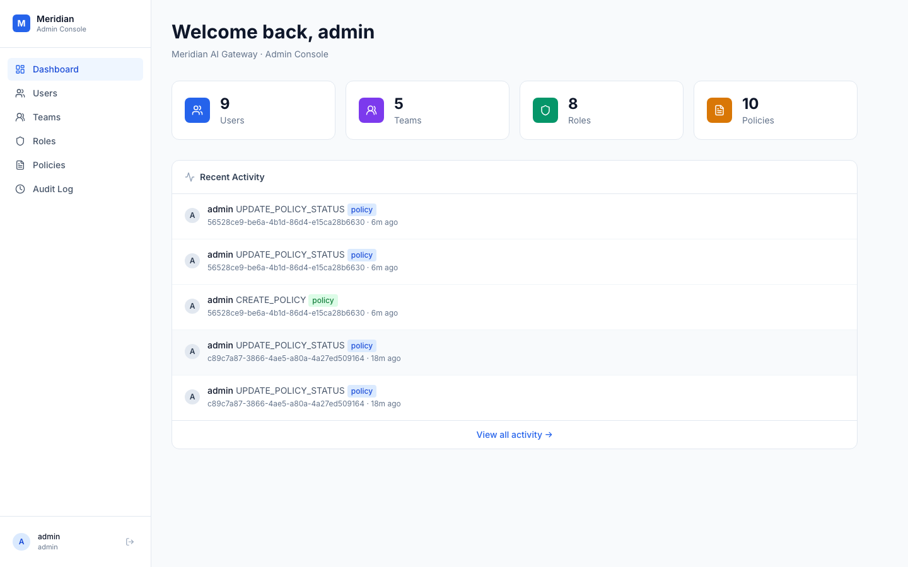
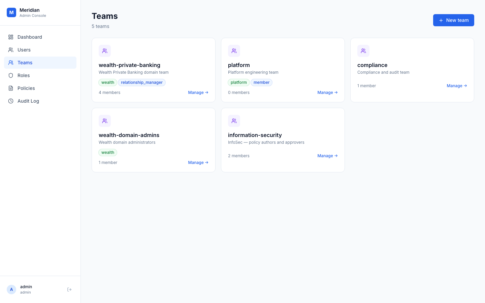
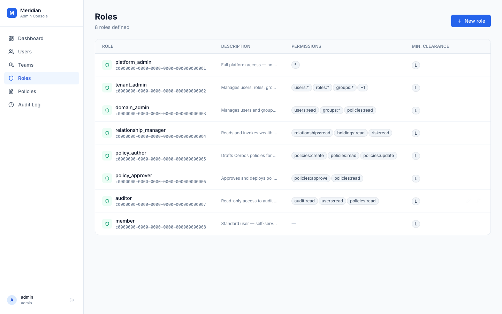
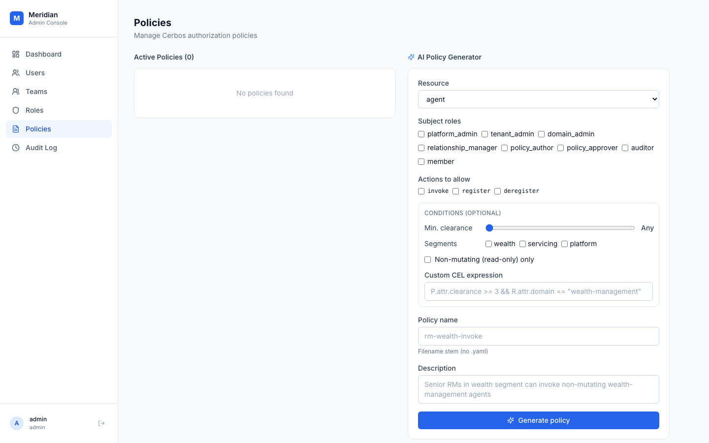
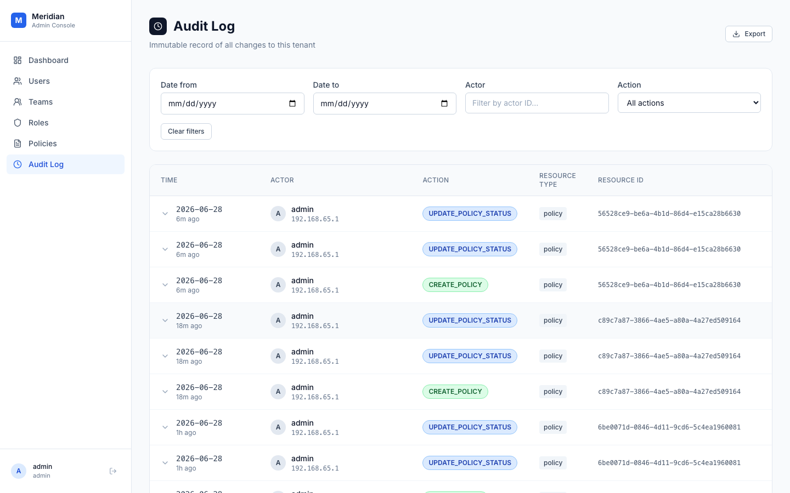

# Axiom

**AI-powered access governance for the enterprise.**

Axiom is the identity and authorization backbone of the Meridian AI Gateway. It answers one question that every enterprise AI deployment eventually hits: *who is allowed to ask what, and how do you govern that at scale without a 6-month IAM project?*

The answer: give your security team an AI that understands enterprise authorization models, knows your live roles and tenants, and generates production-grade Cerbos YAML from plain English — then validates every generated policy against a golden dataset before it ever touches a PDP.

Axiom is the platform. **PolicyForge** is the AI policy generation capability inside it.

---

## What It Does

| Capability | How |
|---|---|
| **Identity management** | Users, teams, and roles with JWT-based auth (RS256, Spring Authorization Server) |
| **Fine-grained ABAC** | Cerbos PDP enforces resource policies — tenant isolation, domain scoping, book-based entitlements |
| **AI policy generation** | Describe what you want in plain English → Z.AI GLM-5.2 generates Cerbos YAML with few-shot enterprise IAM examples |
| **Policy lifecycle** | Draft → Approve → Deploy workflow with role-gated transitions |
| **Immutable audit log** | Every write is recorded (actor, action, before/after state, IP, correlation ID) in PostgreSQL JSONB |
| **Golden dataset validation** | 35 adversarial test cases cover all role × resource × action combinations; CI exits non-zero on any regression |
| **SSO / OIDC** | Spring Authorization Server issues tokens; LibreChat and the gateway authenticate against it |

---

## Screenshots

### Dashboard — Live Activity Feed



The admin console lands here. At a glance: how many users, teams, roles, and policies are active in this tenant. The recent activity feed shows every policy lifecycle event in real time — so the security team always knows what changed and who changed it.

---

### Teams — Domain-Scoped Organization



Teams are the organizational unit that maps to business domains. `wealth-private-banking` carries the `wealth` and `relationship_manager` tags — membership in that team determines which Cerbos derived roles a user can acquire. The `information-security` team owns the policy author/approver workflow.

---

### Roles — The RBAC Matrix



Eight roles, from `platform_admin` (full access, no tenant boundary) down to `member` (self-service only). Each role is a named grant of specific permissions: `relationship_manager` gets `relationships:read`, `holdings:read`, `risk:read` — nothing more. The `policy_author` / `policy_approver` split enforces four-eyes on every policy change.

---

### AI Policy Generator — Plain English → Cerbos YAML



This is the core innovation. Instead of writing Cerbos YAML by hand (and risking the `roles`+`derivedRoles` OR-semantics trap, or a `parentRoles: ["*"]` blast radius), a security engineer:

1. Picks the resource type (`agent`, `relationship`, `iam-resource`)
2. Checks which roles should be granted access
3. Selects allowed actions
4. Optionally sets a minimum data classification and a custom CEL expression
5. Hits **Generate policy**

The backend sends this intent to Z.AI GLM-5.2 with a system prompt that embeds:
- 6 enterprise IAM principles (Okta FGA / OPA / Cerbos model)
- 5 hard rules about Cerbos evaluation semantics (including the OR trap)
- The data classification ladder (`internal` → `confidential` → `confidential-pii` → `restricted`)
- Live roles and tenants pulled from the database at call time
- 3 few-shot examples (agent policy, relationship entitlement, IAM RBAC)
- 26 acceptance criteria the generated policy must satisfy

The result: production-grade Cerbos YAML, explained in plain English, with a warning list if anything is ambiguous.

---

### Audit Log — Immutable Evidence Trail



Every write emits an audit row. The log is filterable by date, actor, action, and resource type. Each row expands to show the full before/after state diff (stored as JSONB). This is not a log file — it is a first-class entity, queryable, exportable, and Cerbos-gated (only `auditor` role can read it, and only within their own tenant).

---

## Architecture

```
┌─────────────────────────────────────────────────────────────────┐
│  Admin UI (React + Vite, port 5180)                             │
│  Dashboard · Users · Teams · Roles · Policies · Audit Log       │
└────────────────────────┬────────────────────────────────────────┘
                         │ REST (JWT Bearer)
┌────────────────────────▼────────────────────────────────────────┐
│  IAM Service (Spring Boot 3.5, Java 21, virtual threads)        │
│                                                                  │
│  ┌──────────────┐  ┌─────────────────────┐  ┌───────────────┐  │
│  │ Spring Auth  │  │ LlmPolicyGeneration │  │ CerbosAuthz   │  │
│  │ Server       │  │ Service             │  │ Service       │  │
│  │ (RS256 JWT)  │  │ (Z.AI GLM-5.2)      │  │ (PDP sidecar) │  │
│  └──────────────┘  └─────────────────────┘  └───────────────┘  │
│                                                                  │
│  Entities: Principal · Role · Team · Domain · Policy · AuditLog │
└─────────┬───────────────────────┬───────────────────────────────┘
          │                       │
    ┌─────▼──────┐         ┌──────▼──────┐
    │ PostgreSQL │         │ Cerbos PDP  │
    │ (entities  │         │ (port 3594) │
    │  + audit)  │         └─────────────┘
    └────────────┘
```

**Auth flow:** Admin UI → `POST /auth/login` → RS256 JWT with `roles` claim → every subsequent request carries the token → Spring Security maps `roles` claim to `ROLE_` authorities → `@PreAuthorize` gates controllers → `CerbosAuthzService` does fine-grained resource-level check via Cerbos PDP.

**Policy generation flow:** Form → `POST /admin/policies/generate` → `LlmPolicyGenerationService` builds system prompt with live context → Z.AI GLM-5.2 → YAML returned → saved as `DRAFT` → promoted to `ACTIVE` by a `policy_approver`.

---

## The Golden Dataset

35 adversarial test cases that define what "correctly configured" means:

| Category | Cases | What it tests |
|---|---|---|
| `AGT` | 12 | Agent invoke/register/deregister — cross-tenant denial, segment scoping, platform_admin override |
| `REL` | 6 | Relationship read — book-based entitlement (in-book ALLOW, out-of-book DENY) |
| `IAM` | 12 | Full RBAC matrix — every role × resource_type × action combination |
| `SEC` | 5 | Critical invariants — cross-tenant admin isolation, guest denial, data classification gates |

Run it against the live PDP:

```bash
python3 eval/cerbos_policy_eval.py --verbose
# or only the invariants that block deployment:
python3 eval/cerbos_policy_eval.py --tags critical,invariant
```

Exit 0 = all pass. Exit 1 = failures. Exit 2 = Cerbos unreachable. Critical failures print with `🔴 CRITICAL` and the message: *policy is unsafe to deploy*.

---

## Key Design Decisions

**Why Cerbos instead of OPA or hand-rolled RBAC?**
Cerbos gives you a PDP sidecar that evaluates policies from YAML files, exposes a gRPC/HTTP API, and has first-class support for derived roles and CEL conditions. The `PlanResources` API lets you prune what the gateway even fans out to — before any agent is called, Cerbos answers "which of these resources would I allow?" This is the *prune-before-fan-out* pattern that keeps unauthorized data from ever being fetched.

**Why the `roles`+`derivedRoles` OR semantics matter so much:**
In Cerbos, listing both `roles` and `derivedRoles` in the same rule means *either* triggers it. If you use `parentRoles: ["*"]` on a derived role and then list it alongside a plain role in a CRUD rule, every authenticated user gets CRUD access. This is the #1 footgun in Cerbos policy authoring — and it's exactly what the LLM's system prompt warns against, with a concrete example of the wrong and right pattern.

**Why GLM-5.2?**
Z.AI's flagship model (200K context, function-calling, structured output, streaming). The IAM system prompt is dense — live roles, tenants, few-shots, 26 acceptance criteria — and needs a model that can hold all of it in context and produce syntactically valid YAML with correct CEL. GLM-5.2 handles this without truncation or hallucination of role names.

**Why a structured form + free-text intent?**
Security engineers who know what they want can fill out the form. New engineers, or anyone experimenting, can type "allow senior RMs to read wealth agent data but only within their domain." The backend accepts both — `buildIntentFromStruct()` converts the form into natural language if no `intent` field is provided.

---

## Running It

### Prerequisites

- Docker + Compose v2
- `ZAI_API_KEY` (Z.AI GLM-5.2 — for policy generation)

### Start

```bash
# From the repo root
export ZAI_API_KEY=your_key_here
docker compose up -d iam-service iam-ui iam-db cerbos

# Admin console
open http://localhost:5180

# Default credentials
# username: admin  password: admin

# API base
curl http://localhost:8081/health
```

### Generate a policy via API

```bash
# Free-text intent
curl -s -X POST http://localhost:8081/admin/policies/generate \
  -H "Authorization: Bearer $TOKEN" \
  -H "Content-Type: application/json" \
  -d '{
    "intent": "Allow relationship managers to read and list agent resources in the wealth segment, but only if the agent is non-mutating",
    "resourceType": "agent"
  }' | jq .yaml
```

### Run the golden dataset

```bash
python3 eval/cerbos_policy_eval.py --verbose
```

### Run E2E tests

```bash
cd e2e
npm ci
npx playwright test tests/09-cerbos-authz.spec.ts
# 28/28 passing
```

---

## What's Next

- **LibreChat SSO** — wire LibreChat's `openid_connect` auth strategy to the IAM service's OIDC discovery endpoint (`/.well-known/openid-configuration`), so users log in once and their identity flows through to the gateway's Cerbos enforcement
- **Policy simulation** — before `ACTIVE`, run the golden dataset against the new policy in a sandbox Cerbos instance and show the diff
- **Role recommendations** — given a team's existing roles and resource access patterns, suggest the minimal permission set (least-privilege advisor)
- **Langfuse continuous eval** — score every policy generation call for faithfulness to the intent, Cerbos validity, and alignment with the golden dataset acceptance criteria

---

## Files

```
iam-service/
├── src/main/java/com/openwolf/iam/
│   ├── service/
│   │   ├── LlmPolicyGenerationService.java   # Z.AI GLM-5.2 call + system prompt
│   │   └── PolicyService.java                # draft/approve/deploy lifecycle
│   ├── security/CerbosAuthzService.java      # Cerbos PDP client
│   └── entity/                               # Principal, Role, Team, Policy, AuditLog
├── src/main/resources/application.yml
└── README.md                                 # this file

infra/cerbos/policies/
├── iam_resource.yaml                         # RBAC matrix (the critical one)
├── iam_derived_roles.yaml                    # same_tenant, domain_scoped_admin, etc.
└── relationship_resource.yaml                # book-based entitlement

eval/
├── cerbos_golden_dataset.json                # 35 adversarial test cases
└── cerbos_policy_eval.py                     # CLI runner — exits 1 on any failure
```
